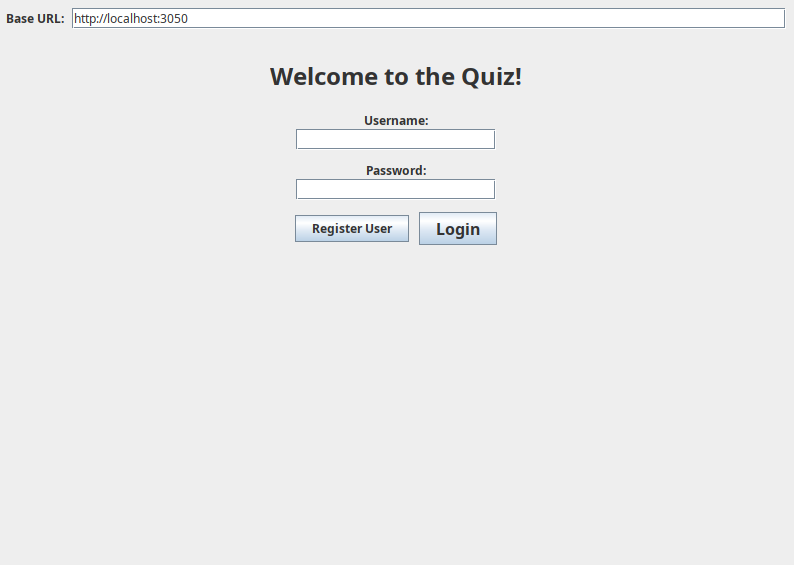
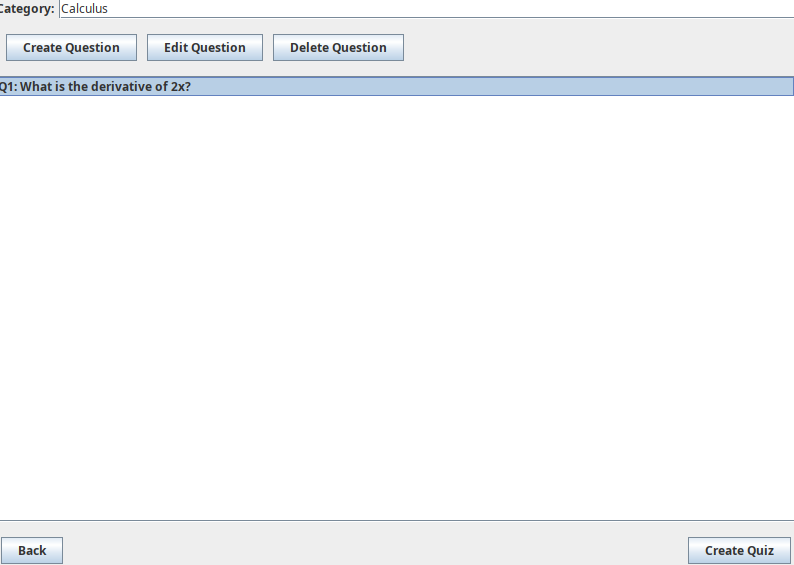
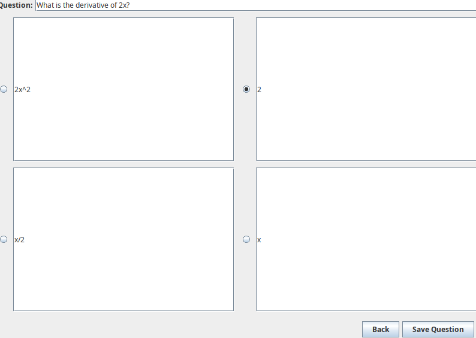
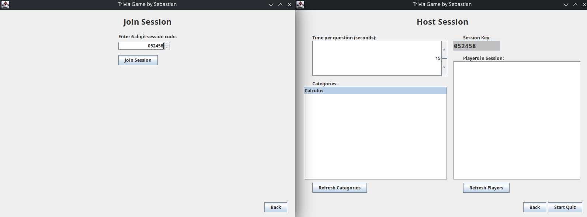
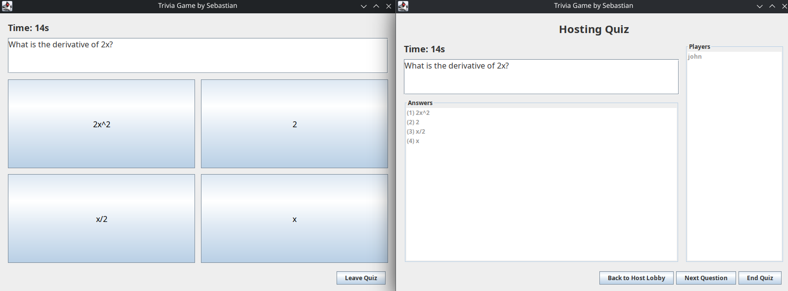

# Real-Time Quiz Platform

A full-stack, real-time quiz application built in Java with a RESTful server, a desktop client (Swing), and a MySQL database.

This project demonstrates end-to-end system design, including API development, client-server communication, database integration, and containerized deployment.


## Overview

The platform allows users to:

* Register and authenticate securely
* Create and manage quiz categories and questions
* Host and join real-time quiz sessions
* Participate in multiplayer quiz gameplay through a GUI client

## Screenshots of Client

### Login


### Quiz Creator


### Question Creator


### Game Host


### Game


## Architecture

```
Java Swing Client  ⇄  REST API Server (Java)  ⇄  MySQL (Docker)
```

* **Client**: Java Swing desktop application
* **Server**: Java HTTP server exposing REST endpoints
* **Database**: MySQL with relational schema and constraints


## Tech Stack

* **Java 21**
* **Java HttpServer (REST API)**
* **Swing (GUI Client)**
* **MySQL 8**
* **Docker & Docker Compose**
* **JDBC (MySQL Connector/J)**
* **jBCrypt (password hashing)**
* **JSON (org.json)**

## Client Screenshots

---

## Running the Application (Recommended)

### Start server + database

```bash
docker compose up --build
```

* Server runs on: `http://localhost:3050`
* MySQL runs on: `localhost:3306`

## Build and Run the Server (Manual)

From the `Server/` directory:

### Compile

```bash
mkdir -p out
find src -name "*.java" > sources.txt
javac -cp "lib/*" -d out @sources.txt
```

### Run

```bash
java -cp "out:lib/*" server.AppServer
```

---

## Build and Run the Client

### Linux / Mac

```bash
chmod +x run-client.sh
./run-client.sh
```

### Windows

```
Run: run-client.bat
```

---

## REST API Overview

The server exposes endpoints for:

* **Users** → register and authenticate
* **Login** → credential verification
* **Categories** → manage quiz topics
* **Questions/Answers** → create and retrieve quiz data
* **Sessions** → host and join multiplayer games
* **Health** → server status

## Database Design

Core tables:

* `users`
* `categories` (user-specific)
* `questions`
* `answers`

All relationships are enforced with foreign keys and constraints.

## Future Improvements

* Clean up cluttered code
* Web-based frontend (React or similar)
* Real-time updates using WebSockets
* Improved UI/UX design
* Automated testing (unit + integration)
* Deployment to cloud (AWS/GCP)